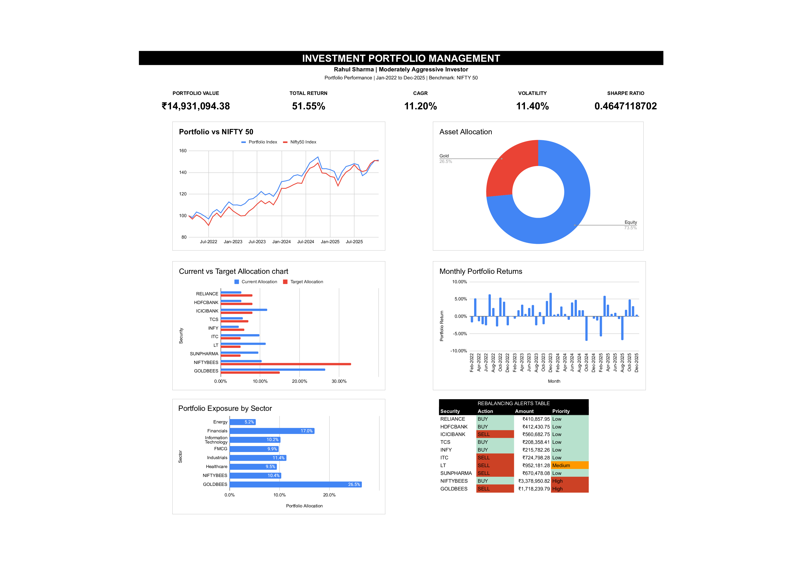

# Investment Portfolio Management & Wealth Advisory Model

## Project Overview

This project is an Excel-based Investment Portfolio Management and Wealth Advisory Model developed for a fictional client, Rahul Sharma, a moderately aggressive investor.

The model evaluates portfolio performance, risk, diversification, asset allocation, benchmark performance, and rebalancing requirements to support investment decision-making.

## Client Profile

- **Client:** Rahul Sharma
- **Age:** 35
- **Investable Assets:** ₹1 Crore
- **Investment Horizon:** 10 Years
- **Investment Objective:** Long-Term Wealth Creation
- **Risk Profile:** Moderately Aggressive
- **Liquidity Requirement:** Medium
- **Primary Objective:** Capital Appreciation
- **Benchmark:** NIFTY 50
- **Review Frequency:** Quarterly

## Portfolio

The portfolio consists of diversified equity holdings, a broad-market equity ETF, and a gold ETF.

### Holdings

- Reliance Industries
- HDFC Bank
- ICICI Bank
- Tata Consultancy Services
- Infosys
- ITC
- Larsen & Toubro
- Sun Pharmaceutical Industries
- Nippon India ETF Nifty BeES
- Nippon India ETF Gold BeES

The target portfolio allocation is **85% equity and 15% gold**, with NIFTYBEES serving as the core diversified equity position and individual stocks serving as satellite positions.

## Performance Analysis

**Analysis Period:** January 2022 – December 2025

| Metric | Portfolio | NIFTY 50 |
|---|---:|---:|
| Total Return | 51.55% | 50.69% |
| CAGR | 11.20% | 11.04% |
| Annualized Volatility | 11.40% | 12.47% |
| Sharpe Ratio | 0.465 | 0.423 |
| Maximum Drawdown | -13.96% | -14.28% |

The portfolio generated a slightly higher CAGR and Sharpe ratio than the NIFTY 50 while maintaining lower annualized volatility and a slightly better maximum drawdown.

## Portfolio Valuation

- **Initial Investment:** ₹9.99 Million
- **Current Portfolio Value:** ₹14.93 Million
- **Portfolio Gain:** ₹4.94 Million
- **Portfolio Return:** 49.42%

The portfolio valuation is based on the actual holdings and their respective purchase prices and closing prices.

## Risk Analysis

The model evaluates:

- Annualized volatility
- Sharpe ratio
- Maximum drawdown
- Best monthly return
- Worst monthly return
- Percentage of positive months

Monthly month-end portfolio values are used for the performance and risk analysis.

## Asset Allocation

### Target Allocation

- **Equity:** 85%
- **Gold:** 15%

### Current Allocation

- **Equity:** 73.49%
- **Gold:** 26.51%

The portfolio is currently underweight equity and overweight gold relative to the target allocation.

## Diversification

The model analyzes portfolio exposure across:

- Energy
- Financials
- Information Technology
- FMCG
- Industrials
- Healthcare
- Broad-market equity ETF
- Gold ETF

This helps identify sector and asset-class concentration and supports more informed portfolio allocation decisions.

## Rebalancing

The rebalancing module compares current portfolio weights with target weights and calculates the required buy or sell amount.

### Key Rebalancing Actions

| Security | Action | Amount | Priority |
|---|---|---:|---|
| NIFTYBEES | BUY | ₹3.38M | High |
| GOLDBEES | SELL | ₹1.72M | High |
| LT | SELL | ₹0.95M | Medium |

The largest recommended adjustment is to increase the diversified NIFTYBEES allocation while reducing excess gold exposure.

## Wealth Advisory Recommendations

Based on the portfolio analysis:

1. Increase NIFTYBEES toward its target allocation.
2. Reduce GOLDBEES exposure toward the 15% target.
3. Reduce the overweight position in Larsen & Toubro.
4. Reduce excess concentration in individual equity positions.
5. Increase underweight core equity positions.
6. Review and rebalance the portfolio quarterly.

## Dashboard



The dashboard provides a consolidated view of:

- Portfolio value
- Total return
- CAGR
- Volatility
- Sharpe ratio
- Portfolio vs NIFTY 50
- Asset allocation
- Current vs target allocation
- Monthly portfolio returns
- Portfolio exposure
- Rebalancing alerts

## Tools & Skills

### Technical

- Excel / Spreadsheet Modeling
- Google Sheets
- Financial Analysis
- Portfolio Analysis
- Risk Analysis
- Asset Allocation
- Portfolio Rebalancing
- Benchmark Analysis
- Data Analysis
- Financial Dashboard Development

### Financial

- Portfolio Return
- CAGR
- Volatility
- Sharpe Ratio
- Maximum Drawdown
- Diversification
- Asset Allocation
- Benchmarking
- Rebalancing
- Wealth Advisory

## Project Structure

```text
investment-portfolio-management/
│
├── README.md
│
├── Excel Model/
│   └── Investment_Portfolio_Management_Model.xlsx
│
├── Dashboard/
│   ├── Portfolio_Dashboard.png
│   └── Portfolio_Dashboard.pdf
│
├── Screenshots/
│
└── Documentation/

Disclaimer

This project is an educational portfolio-management model based on a fictional client profile and historical market data. It is not investment advice or a recommendation to buy or sell any security.

Note: The benchmark used in this model is the NIFTY 50 price index and not the NIFTY 50 Total Return Index (TRI).
