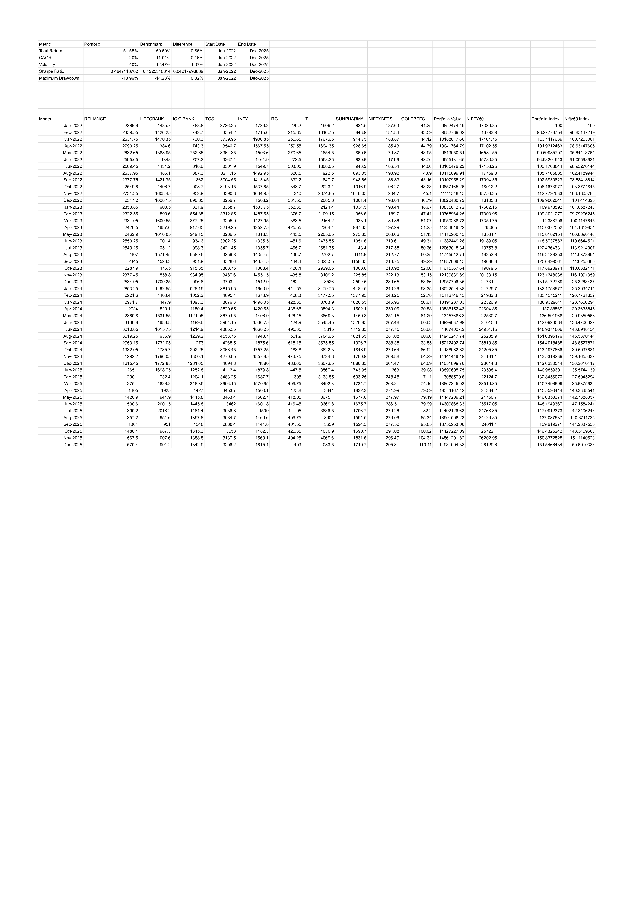
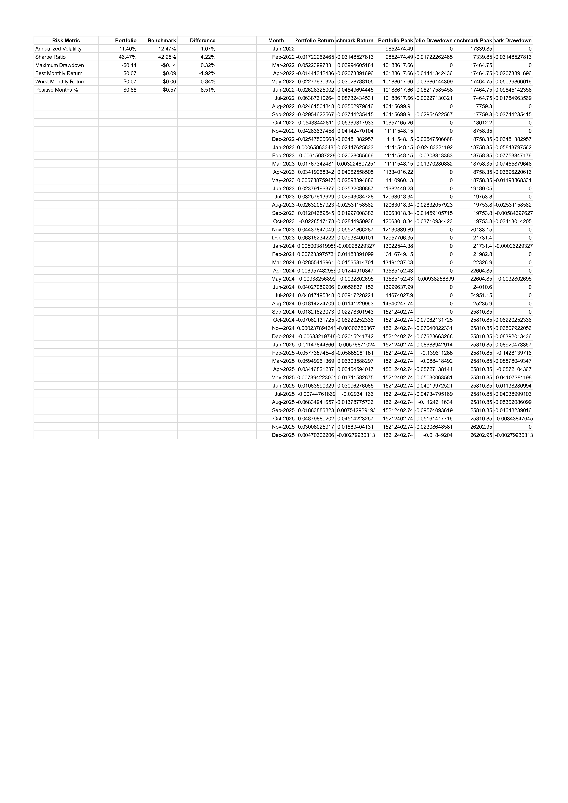
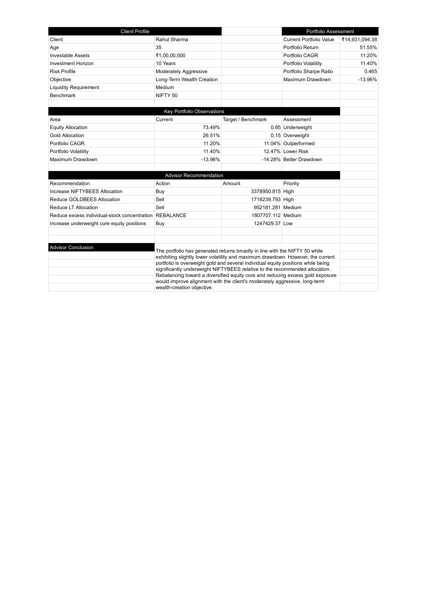

# Investment Portfolio Management & Wealth Advisory Model

## Project Overview

This project is an Excel-based Investment Portfolio Management and Wealth Advisory Model developed for a fictional client, Rahul Sharma, a moderately aggressive investor.

The model evaluates portfolio performance, risk, diversification, asset allocation, benchmark performance, and rebalancing requirements to support investment decision-making.

## Client Profile

| Parameter | Details |
|---|---|
| Client | Rahul Sharma |
| Age | 35 |
| Investable Assets | ₹1 Crore |
| Investment Horizon | 10 Years |
| Investment Objective | Long-Term Wealth Creation |
| Risk Profile | Moderately Aggressive |
| Liquidity Requirement | Medium |
| Primary Objective | Capital Appreciation |
| Benchmark | NIFTY 50 |
| Review Frequency | Quarterly |

## Portfolio

The portfolio consists of diversified equity holdings, a broad-market equity ETF, and a gold ETF.

### Holdings

- Reliance Industries
- HDFC Bank
- ICICI Bank
- Tata Consultancy Services
- Infosys
- ITC
- Larsen & Toubro
- Sun Pharmaceutical Industries
- Nippon India ETF Nifty BeES
- Nippon India ETF Gold BeES

The target portfolio allocation is 85% equity and 15% gold, with NIFTYBEES serving as the core diversified equity position and individual stocks serving as satellite positions.

## Portfolio Analysis

The Portfolio worksheet calculates invested value, current value, gain/loss, and return for each holding.


## Performance Analysis

The Performance worksheet compares portfolio performance with the NIFTY 50 using total return, CAGR, volatility, Sharpe ratio, and maximum drawdown.

### Key Performance Metrics

| Metric | Portfolio | NIFTY 50 |
|---|---:|---:|
| Total Return | 51.55% | 50.69% |
| CAGR | 11.20% | 11.04% |
| Annualized Volatility | 11.40% | 12.47% |
| Sharpe Ratio | 0.465 | 0.423 |
| Maximum Drawdown | -13.96% | -14.28% |



## Risk Analysis

The Risk Analysis worksheet evaluates portfolio risk relative to the NIFTY 50 using annualized volatility, Sharpe ratio, maximum drawdown, best monthly return, worst monthly return, and positive-month percentage.



## Asset Allocation

The portfolio has a target allocation of 85% equity and 15% gold.

The current portfolio allocation is:

- Equity: 73.49%
- Gold: 26.51%

The model compares current allocation with target allocation to identify overweight and underweight positions.


## Diversification Analysis

The diversification analysis evaluates portfolio exposure across sectors and investment categories, including Energy, Financials, Information Technology, FMCG, Industrials, Healthcare, NIFTYBEES, and GOLDBEES.


## Rebalancing Analysis

The Rebalancing worksheet compares current portfolio weights with target weights and calculates the required buy or sell amount for each security.

### Key Rebalancing Actions

| Security | Action | Amount | Priority |
|---|---|---:|---|
| NIFTYBEES | BUY | ₹3.38M | High |
| GOLDBEES | SELL | ₹1.72M | High |
| LT | SELL | ₹0.95M | Medium |


## Wealth Advisory

The Wealth Advisory worksheet converts the portfolio analysis into actionable recommendations based on the client's risk profile, investment horizon, asset allocation, and portfolio performance.

### Key Recommendations

1. Increase NIFTYBEES toward its target allocation.
2. Reduce GOLDBEES exposure toward the 15% target.
3. Reduce the overweight position in Larsen & Toubro.
4. Reduce excess concentration in individual equity positions.
5. Increase underweight core equity positions.
6. Review and rebalance the portfolio quarterly.



## Dashboard

The dashboard provides a consolidated view of the portfolio and wealth-management analysis.

It includes:

- Portfolio value
- Total return
- CAGR
- Volatility
- Sharpe ratio
- Portfolio vs NIFTY 50
- Asset allocation
- Current vs target allocation
- Monthly portfolio returns
- Portfolio exposure
- Rebalancing alerts


## Portfolio Valuation

- **Initial Investment:** ₹9.99 Million
- **Current Portfolio Value:** ₹14.93 Million
- **Portfolio Gain:** ₹4.94 Million
- **Portfolio Return:** 49.42%

## Tools & Skills

### Technical Skills

- Excel / Spreadsheet Modeling
- Google Sheets
- Financial Analysis
- Portfolio Analysis
- Risk Analysis
- Asset Allocation
- Portfolio Rebalancing
- Benchmark Analysis
- Data Analysis
- Financial Dashboard Development

### Financial Concepts

- Portfolio Return
- CAGR
- Volatility
- Sharpe Ratio
- Maximum Drawdown
- Diversification
- Asset Allocation
- Benchmarking
- Portfolio Rebalancing
- Wealth Advisory

## Disclaimer

This project is an educational portfolio-management model based on a fictional client profile and historical market data. It is not investment advice or a recommendation to buy or sell any security.

Note: The benchmark used in this model is the NIFTY 50 price index and not the NIFTY 50 Total Return Index (TRI).

## Project Structure

```text
investment-portfolio-management/
│
├── README.md
│
├── Excel Model/
│   └── Investment_Portfolio_Management_Model.xlsx
│
├── Dashboard/
│   ├── Portfolio_Dashboard.png
│   └── Portfolio_Dashboard.pdf
│
└── Screenshots/
    ├── Portfolio_Analysis.png
    ├── Performance.png
    ├── Risk_Analysis.png
    ├── Asset_Allocation.png
    ├── Diversification.png
    ├── Rebalancing.png
    └── Wealth_Advisory.png
